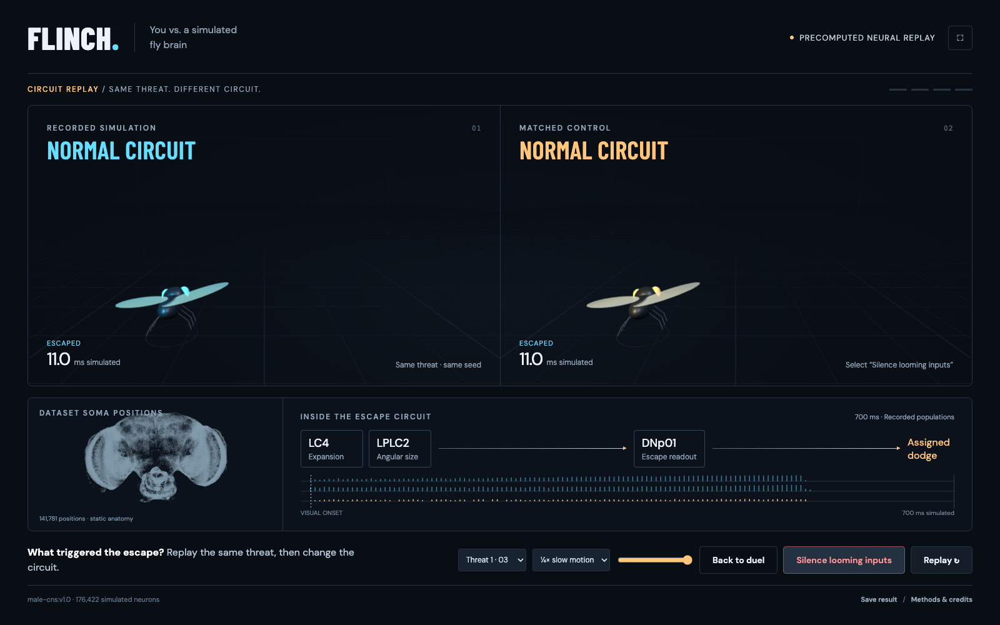

# FLINCH: You vs. a simulated fly brain

A playable escape duel against a connectome-based fly model, with an interactive normal/silenced circuit replay.

**[Play FLINCH in your browser](https://flinch-fly-brain-duel.vercel.app)**



```sh
npm install
npm run dev
```

Open the URL printed by Vite. Space or the Dodge button controls your fly. Two practice attempts lead into four validated collision courses. Inspect circuit opens a quarter-speed replay; silence LC4/LPLC2 outputs, then restore the original baseline. The top-right button enters full-screen presentation mode. Save result downloads local attempt logs. Replay URLs preserve the selected threat, seed and circuit condition.

The existing trace bank is already packaged under `public/data/flinch/`. `npm run pack` repackages saved evidence without running Java. No neural recalibration is needed to run the frontend. `npm run build` creates a static `dist/` build. `npm test` checks geometry, trace validation and null outcomes. `node tools/browser-check.mjs` and `node tools/full-flow-check.mjs` use installed Chrome for browser verification while Vite runs.

For an external recording of the real circuit comparison:

```sh
npx playwright install ffmpeg
node tools/record-demo.mjs
```

The video captures normal → silenced → restored simulations. It makes no claim to record a human reaction test. Record your own played duel through a screen recorder if you want human play in the X clip.

Read [the backend decision](docs/BACKEND-DECISION.md) for model provenance and [implementation notes](docs/IMPLEMENTATION.md) for the shipped scope.

FLINCH source code is copyright © 2026 Mahmood Khordoo and released under the MIT License. The bundled neural evidence is derived from the `male-cns:v1.0` dataset and remains CC BY 4.0; full attribution and transformations are documented in the backend decision.
